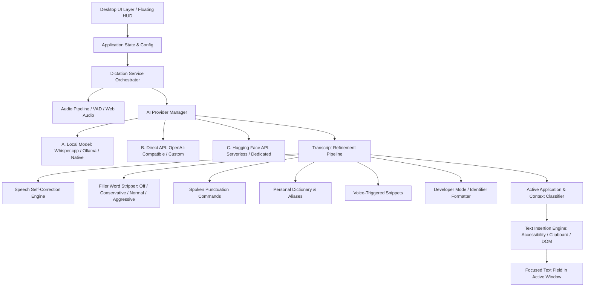

# Vocalis Desktop Voice Studio

> **Production-Quality, Model-Agnostic Desktop Voice Dictation Platform**  
> *A fast, local-first alternative to commercial dictation utilities with system-wide hotkeys, context awareness, and text insertion.*

---

## 1. Executive Summary & Core Principles

Vocalis is a desktop-first voice productivity application that captures speech, processes it through a pluggable AI provider, cleans up transcriptions in real time (removing fillers, resolving backtracked speech, expanding snippets, and applying capitalization), detects the active focused application, and inserts the formatted text directly into the active field.

### Core Non-Negotiables:
1. **Zero Payment System**: Vocalis contains **no** billing, pricing tiers, subscriptions, checkout flows, Stripe/PayPal SDKs, or trial lockouts. It is strictly a free, user-configured platform.
2. **Model-Agnostic Architecture**: The application never hard-codes or enforces a specific AI model. It features **EXACTLY THREE** pluggable provider categories:
   - **A. LOCAL MODEL** (offline on-device inference via Whisper.cpp, Ollama, native ONNX, or local HTTP server)
   - **B. DIRECT API** (user-configured OpenAI-compatible, Groq, Deepgram, or private API endpoints)
   - **C. HUGGING FACE API** (Hugging Face Serverless Inference or dedicated inference endpoints with user token)
3. **Context Awareness**: Classifies active windows into categories (Code Editor, Terminal, Email, Messaging, Documentation, AI Chat, Notes) and applies domain-specific formatting without destroying syntax.
4. **Data Privacy**: Stored locally by default. Raw audio is never saved to disk. All API keys and tokens are masked in local memory and automatically scrubbed from diagnostics and logs.

---

## 2. System Architecture Diagram



---

## 3. Pluggable AI Provider Architecture

The AI layer is decoupled from audio capture, UI, hotkeys, and text insertion behind the `IAIProvider` interface:

```typescript
export interface IAIProvider<TConfig = unknown> {
  readonly id: string;
  readonly name: string;
  readonly description: string;

  getCapabilities(): AIProviderCapabilities;
  validateConfiguration(config: TConfig): { valid: boolean; errors: string[] };
  healthCheck(config: TConfig): Promise<{ healthy: boolean; message: string; latencyMs?: number }>;
  transcribeAudio(audioBlob: Blob, config: TConfig, onProgress?: (p: TranscriptionProgress) => void, abortSignal?: AbortSignal): Promise<{ text: string; confidence: number; durationSeconds?: number }>;
  streamTranscription?(audioStream: MediaStream, config: TConfig, onChunk: (text: string) => void, abortSignal?: AbortSignal): Promise<void>;
  refineTranscript(request: RefinementRequest, config: TConfig, abortSignal?: AbortSignal): Promise<RefinementResult>;
}
```

### Supported Providers:
- **Local Model Provider**:
  - Model Path / Directory selection
  - Load / Unload model memory allocation inspection
  - Adapter options: Whisper.cpp (C++), Ollama, Local HTTP Server (`http://localhost:8080/v1`), Native ONNX Runtime, and Custom CLI Binaries
- **Direct API Provider**:
  - Configurable Base URL (e.g. `https://api.openai.com/v1` or custom proxy)
  - Masked API Key storage
  - User-specified Model ID (e.g. `whisper-1`)
  - Optional Refinement Model ID (e.g. `gpt-4o-mini`)
  - Exponential backoff retry logic and HTTP 429 rate-limit handling
- **Hugging Face API Provider**:
  - Hugging Face User Access Token (`hf_...`)
  - Model / Repository ID (e.g. `openai/whisper-large-v3-turbo`)
  - Custom inference endpoint support
  - Cold-start HTTP 503 retry handler (`x-wait-for-model`)

---

## 4. Dictation & Refinement Pipeline

1. **Speech Self-Correction / Backtracking**:
   - Detects verbal corrections: *"Schedule the meeting for 2 pm... actually 3 pm."* $\rightarrow$ `"Schedule the meeting for 3 pm."`
   - Handles phrases like `"scratch that"`, `"I mean"`, `"correction"`, `"no rather"`.
2. **Filler-Word Removal**:
   - Configurable sensitivity: `Off`, `Conservative`, `Normal`, `Aggressive`.
   - Filters `"um"`, `"uh"`, `"you know"`, `"basically"`, `"sort of"`, `"like"`.
3. **Spoken Punctuation & Lists**:
   - Verbal marks: `"comma"`, `"period"`, `"question mark"`, `"new line"`, `"open quote"`.
   - Detects spoken lists: *"groceries one apples two bananas three milk"* $\rightarrow$ formatted numbered or bulleted list.
4. **Personal Dictionary & Snippets**:
   - Technical word casing: `TypeScript`, `Kubernetes`, `PostgreSQL`.
   - Voice trigger snippet expansions: *"my email signature"* $\rightarrow$ multiline sign-off.
5. **Developer / Code Mode**:
   - Automatically handles `camelCase`, `PascalCase`, `snake_case`, CLI flags (`--save-dev`, `-p`), and function signatures (`getUserData()`).

---

## 5. Text Insertion Engine & Safety

Vocalis supports multi-strategy text insertion with automatic fallback:
1. **Strategy 1: Accessibility Adapter** (Direct OS UI Automation input injection).
2. **Strategy 2: Clipboard + Simulated Paste with Guaranteed Restoration**:
   - Reads current clipboard content before insertion.
   - Pastes new transcript into target application.
   - Automatically restores user's original clipboard contents after configurable delay (default: 250ms).
3. **Strategy 3: Synthetic DOM Dispatch** (For web/browser targets).

---

## 6. Installation & Development

### Prerequisites
- Node.js 18+ or 20+
- Modern browser (Chrome / Edge / Firefox) or Electron runtime

### Development Setup
```bash
# 1. Install dependencies
npm install

# 2. Run local development server
npm run dev

# 3. Build for production
npm run build

# 4. Verify syntax & type correctness
npm run lint
```

### Desktop Packaging (Windows / macOS / Linux)
```bash
# Package as Windows portable executable or installer
npm run build
npx electron-builder --win
```

---

## 7. Automated Testing

Vocalis includes an in-app and automated unit test suite covering:
- Backtracking / Self-Correction regex engine
- Conservative & Aggressive filler removal
- Spoken punctuation conversion
- Spoken numbered & bullet list detection
- Personal dictionary matching & alias substitution
- Voice-triggered snippet expansion
- Developer mode syntax & CLI flags
- Provider switching contracts
- Text insertion strategy fallback

Run the test suite anytime in the UI via the **"Run Tests"** button in the header.

---

## 8. Troubleshooting Guide

| Issue | Cause | Resolution |
| :--- | :--- | :--- |
| **Microphone not capturing** | Browser or OS permission denied | Open **Audio & Devices**, select the correct input microphone, and click "Test Microphone". |
| **Local model fails to load** | Path does not exist or missing weights | In **Models / AI Providers > Local Model**, verify model file path and engine type (e.g. Whisper.cpp / Ollama). |
| **API Authentication 401/403** | Expired or invalid API key | In **Direct API** or **Hugging Face**, verify token in the masked input field and run "Test Connection". |
| **Hugging Face Model 503** | Serverless model cold starting on GPU | Enable "Wait for model if cold-starting" in Hugging Face settings. |
| **Text does not insert** | Focused application shielded input | Vocalis will copy the final text to your clipboard automatically if all 3 strategies are blocked. |

---

## 9. License

Open source and free for personal and commercial productivity use. Zero telemetry, zero subscriptions.
